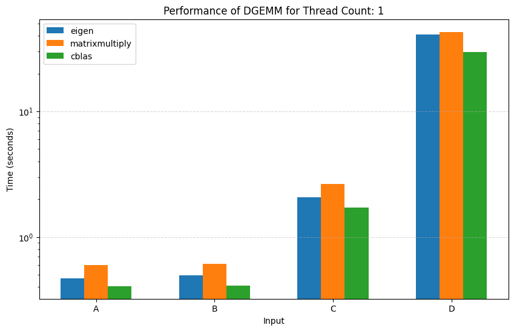
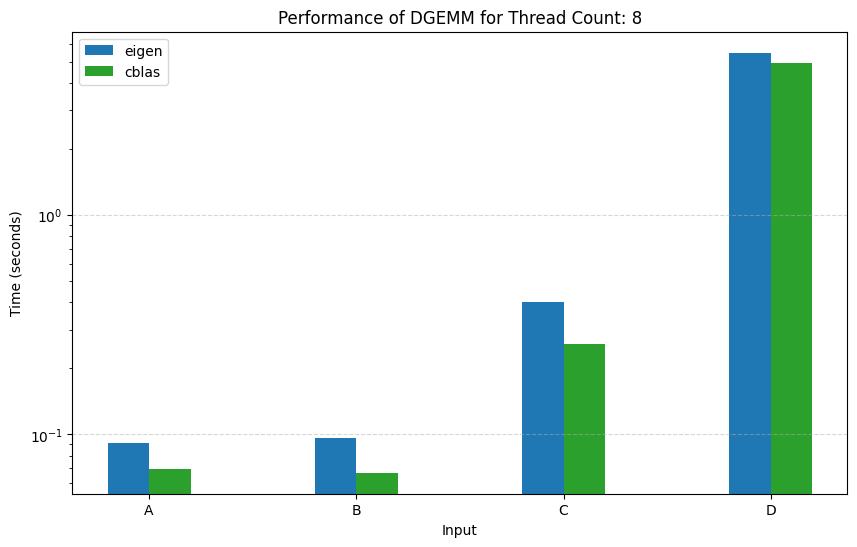
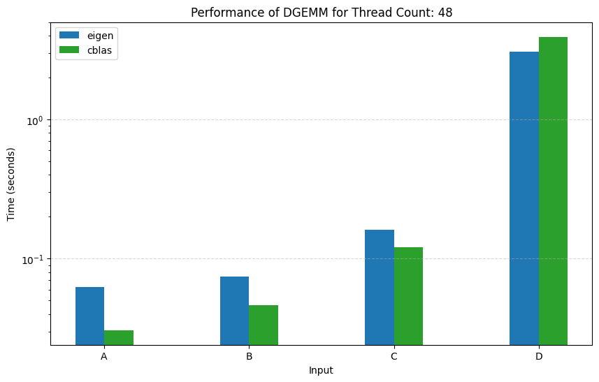

# Matrix Multiplication Bench

Compare MatMul performance of various library implementations.

## Setup

### Note

Eigen and Google's Benchmark need to be located one directory up from gemm_microbench.

### Install Eigen

```bash
#Get Eigen from the official website
wget https://gitlab.com/libeigen/eigen/-/archive/3.4.0/eigen-3.4.0.zip

#Unpack and set the correct name
unzip eigen-3.4.0.zip && rm eigen-3.4.0.zip && mv eigen-3.4.0 Eigen
```

If the above doesn't work, reference [Eigen's Official Website](https://eigen.tuxfamily.org/index.php?title=Main_Page)

### Install Google's Benchmark

```bash
# Check out the library.
$ git clone https://github.com/google/benchmark.git

# Go to the library root directory
$ cd benchmark

# Make a build directory to place the build output
$ cmake -E make_directory "build"

# Generate build system files with cmake, and download any dependencies
$ cmake -E chdir "build" cmake -DBENCHMARK_DOWNLOAD_DEPENDENCIES=on -DCMAKE_BUILD_TYPE=Release ../

# or, starting with CMake 3.13, use a simpler form:
# cmake -DBENCHMARK_DOWNLOAD_DEPENDENCIES=on -DCMAKE_BUILD_TYPE=Release -S . -B "build"
# Build the library
$ cmake --build "build" --config Release

# Next, you can run the tests to check the build
$ cmake -E chdir "build" ctest --build-config Release

# Install the library globally
& sudo cmake --build "build" --config Release --target install
```

If the above doesn't work, reference [Google's Benchmark GitHub](https://github.com/google/benchmark.git)

### Install Intel oneAPU Base Toolkit

```bash
# Download the installer
$ wget https://registrationcenter-download.intel.com/akdlm/IRC_NAS/4a5320d1-0b48-458d-9668-fd0e4501208c/intel-oneapi-base-toolkit-2025.1.3.7_offline.sh

# Run the install script
$ sudo sh ./intel-oneapi-base-toolkit-2025.1.3.7_offline.sh -a --silent --cli --eula accept

# Set the environment variables
$ . /opt/intel/oneapi/setvars.sh
```

If the above doesn't work, reference [Intel oneAPI Base Toolkit's Official Website](https://www.intel.com/content/www/us/en/developer/tools/oneapi/base-toolkit-download.html?packages=oneapi-toolkit&oneapi-toolkit-os=linux&oneapi-lin=offline)

## Running the Benchmark

```bash
# Default setup where the max threads available on your system are used
make all

# This specifies how many threads should be used
make all THREADS=16
```

## Results

The benchmark also checks that the result of the GEMM operation matches across all libraries and crates.

### Single-thread
| Test Case |    Library     | Language  |  Result  |
|-----------|----------------|-----------|----------|
|  Input A  |     Eigen      |    C++    |  0.466s  |
|           | matrixmultiply |   Rust    |  0.599s  |
|           |     CBLAS      |   Rust    |  0.406s  |
|  Input B  |     Eigen      |    C++    |  0.495s  |
|           | matrixmultiply |   Rust    |  0.607s  |
|           |     CBLAS      |   Rust    |  0.409s  |
|  Input C  |     Eigen      |    C++    |  2.073s  |
|           | matrixmultiply |   Rust    |  2.644s  |
|           |     CBLAS      |   Rust    |  1.705s  |
|  Input D  |     Eigen      |    C++    | 40.823s  |
|           | matrixmultiply |   Rust    | 42.953s  |
|           |     CBLAS      |   Rust    | 29.670s  |
<br/>



### 2 Threads
| Test Case |    Library     | Language  |  Result  |
|-----------|----------------|-----------|----------|
|  Input A  |     Eigen      |    C++    |  0.268s  |
|           | matrixmultiply |   Rust    |  0.329s  |
|           |     CBLAS      |   Rust    |  0.207s  |
|  Input B  |     Eigen      |    C++    |  0.281s  |
|           | matrixmultiply |   Rust    |  0.343s  |
|           |     CBLAS      |   Rust    |  0.211s  |
|  Input C  |     Eigen      |    C++    |  1.151s  |
|           | matrixmultiply |   Rust    |  1.443s  |
|           |     CBLAS      |   Rust    |  0.852s  |
|  Input D  |     Eigen      |    C++    | 28.048s  |
|           | matrixmultiply |   Rust    | 25.668s  |
|           |     CBLAS      |   Rust    | 15.485s  |
<br/>


### 4 Threads (Maximum Threads Supported by matrixmultiply)
| Test Case |    Library     | Language  |  Result  |
|-----------|----------------|-----------|----------|
|  Input A  |     Eigen      |    C++    |  0.172s  |
|           | matrixmultiply |   Rust    |  0.209s  |
|           |     CBLAS      |   Rust    |  0.122s  |
|  Input B  |     Eigen      |    C++    |  0.173s  |
|           | matrixmultiply |   Rust    |  0.191s  |
|           |     CBLAS      |   Rust    |  0.124s  |
|  Input C  |     Eigen      |    C++    |  0.609s  |
|           | matrixmultiply |   Rust    |  0.808s  |
|           |     CBLAS      |   Rust    |  0.480s  |
|  Input D  |     Eigen      |    C++    | 14.786s  |
|           | matrixmultiply |   Rust    | 15.655s  |
|           |     CBLAS      |   Rust    |  9.329s  |
<br/>


### 8 Threads
| Test Case |    Library     | Language  |  Result  |
|-----------|----------------|-----------|----------|
|  Input A  |     Eigen      |    C++    |  0.091s  |
|           | matrixmultiply |   Rust    |  0.248s  |
|           |     CBLAS      |   Rust    |  0.0695s |
|  Input B  |     Eigen      |    C++    |  0.0959s |
|           | matrixmultiply |   Rust    |  0.253s  |
|           |     CBLAS      |   Rust    |  0.0668s |
|  Input C  |     Eigen      |    C++    |  0.401s  |
|           | matrixmultiply |   Rust    |  0.976s  |
|           |     CBLAS      |   Rust    |  0.258s  |
|  Input D  |     Eigen      |    C++    |  5.503s  |
|           | matrixmultiply |   Rust    | 15.779s  |
|           |     CBLAS      |   Rust    |  4.948s  |
<br/>



### 16 Threads
| Test Case |    Library     | Language  |  Result  |
|-----------|----------------|-----------|----------|
|  Input A  |     Eigen      |    C++    |  0.0691s |
|           | matrixmultiply |   Rust    |  0.243s  |
|           |     CBLAS      |   Rust    |  0.0498s |
|  Input B  |     Eigen      |    C++    |  0.0767s |
|           | matrixmultiply |   Rust    |  0.246s  |
|           |     CBLAS      |   Rust    |  0.0343s |
|  Input C  |     Eigen      |    C++    |  0.259s  |
|           | matrixmultiply |   Rust    |  1.024s  |
|           |     CBLAS      |   Rust    |  0.165s  |
|  Input D  |     Eigen      |    C++    |  3.381s  |
|           | matrixmultiply |   Rust    | 16.960s  |
|           |     CBLAS      |   Rust    |  3.994s  |
<br/>


### 32 Threads
| Test Case |    Library     | Language  |  Result  |
|-----------|----------------|-----------|----------|
|  Input A  |     Eigen      |    C++    |  0.0606s |
|           | matrixmultiply |   Rust    |  0.231s  |
|           |     CBLAS      |   Rust    |  0.0462s |
|  Input B  |     Eigen      |    C++    |  0.0725s |
|           | matrixmultiply |   Rust    |  0.240s  |
|           |     CBLAS      |   Rust    |  0.0555s |
|  Input C  |     Eigen      |    C++    |  0.235s  |
|           | matrixmultiply |   Rust    |  0.966s  |
|           |     CBLAS      |   Rust    |  0.187s  |
|  Input D  |     Eigen      |    C++    |  2.933s  |
|           | matrixmultiply |   Rust    | 17.732s  |
|           |     CBLAS      |   Rust    |  3.597s  |
<br/>


### 48 Threads (Maximum Threads Supported by my testing machine - Intel(R) Xeon(R) CPU E5-2690 v3 @ 2.60GHz)
| Test Case |    Library     | Language  |  Result  |
|-----------|----------------|-----------|----------|
|  Input A  |     Eigen      |    C++    |  0.0629s |
|           | matrixmultiply |   Rust    |  0.231s  |
|           |     CBLAS      |   Rust    |  0.0307s |
|  Input B  |     Eigen      |    C++    |  0.0744s |
|           | matrixmultiply |   Rust    |  0.234s  |
|           |     CBLAS      |   Rust    |  0.0462s |
|  Input C  |     Eigen      |    C++    |  0.161s  |
|           | matrixmultiply |   Rust    |  1.009s  |
|           |     CBLAS      |   Rust    |  0.121s  |
|  Input D  |     Eigen      |    C++    |  3.065s  |
|           | matrixmultiply |   Rust    | 18.508s  |
|           |     CBLAS      |   Rust    |  3.928s  |
<br/>


